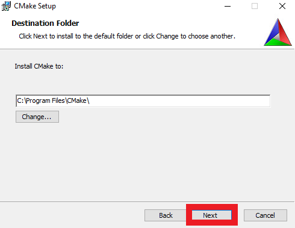
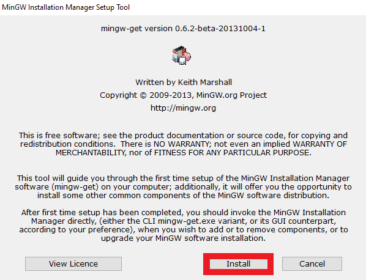
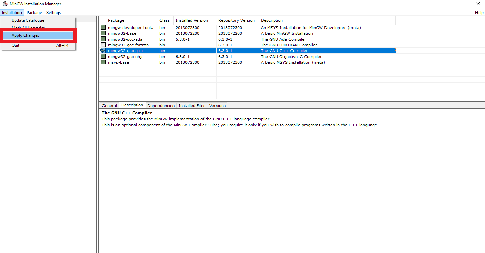
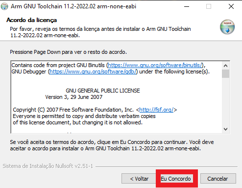

# Teste Pico em C

<h2 align="center"> 
    Teste de Pico em Construção... :pencil2: :zap:
</h2>

# Tabela de conteúdos

<!--ts-->
   * [Tabela de Conteudo](#tabela-de-conteudos)
   * [Sobre](#Sobre-o-projeto)
   * [Instalação](#features)
   * [Images Eaxamples](#images-examples)
   * [Como usar](#Preparando-Ambiente-de-Desenvolvimento)
      * [Pré-Requisitos](#Pre-requisitos)
      * [Procedimento de Instalação](#Procedimento-de-Instalação)
         * [Instalação SDK-PICO](#Instalação-SDK-PICO)
         * [Instalação CMake](#Instalação-CMake)
         * [Instalação Build Visual Studio](#Instalação-Build-Visual-Studio)
         * [Instalação MinGW](#Instalação-MinGW)
         * [Instalação GCC-ARM](#Instalação-GCC-ARM)
         * [Preparando as Variáveis de Ambiente](#Preparando-as-Variáveis-de-Ambiente)
<!--    * [Tests](#testes) -->
   * [Tecnologias](#tecnologias)
   * [Autor](#autor)
<!--te-->

## Sobre o projeto

Criação de um programa teste para estudar o microcontrolador Raspberry Pi Pico.

### Features

- [x] SDK
- [x] Blink

## Preparando Ambiente de Desenvolvimento

### Pré-requisitos
Antes de começar a utilizar o microcontrolador Raspberry Pi, é necessário instalar a SDK par autilização do Pico. Esta SDK é disponibilizada gratuitamente em [Raspberry Pi](https://github.com/raspberrypi). A seguir, há uma lista de pré-requisitos para essa instalação. Logo após, em [Procedimento de Intalação](#procedimento-de-instalação) há um tutorial de como instalar e configurar o ambiente de desenvolvimento, bem como configurar o VSCode.
  * [SDK-PICO](https://github.com/raspberrypi/pico-sdk)
  * [Python v9.x.x ou superior](https://www.python.org/downloads/)
  * [CMake v3.23.x](https://cmake.org/download/)
  * [Ferramentas de Build Visual Studio](https://visualstudio.microsoft.com/pt-br/downloads/)
  * [MinGW - Minimalist GNU for Windows](https://sourceforge.net/projects/mingw/)
  * [GCC Arm GNU Toolchain](https://developer.arm.com/tools-and-software/open-source-software/developer-tools/gnu-toolchain/downloads)
  * [VS Code](https://code.visualstudio.com/Download)

### Procedimento de Instalação

#### Instalação SDK-PICO
Para instalar o SDK-PICO, basta acessar o github do Raspberry Pi e fazer o download zip do projeto [SDK-PICO](https://github.com/raspberrypi/pico-sdk).
    
   
    

#### Instalação CMake
Faça o download do [instalador do CMake](https://cmake.org/download/) e siga os procedimentos de instalação padrão.
    
   
   
    
   
   
    
   
   
    
   
    
   
#### Instalação Build Visual Studio
Faça o download do [instalador do Build Visual Studio](https://visualstudio.microsoft.com/pt-br/downloads/) e siga os procedimentos de instalação padrão.
    
   
   
    
   
    

#### Instalação MinGW
Faça o download do [instalador do MinGW](https://sourceforge.net/projects/mingw/)e siga os procedimentos de instalação padrão.
     
   
   
    
   
   
    
   
    
   
    
   
    

#### Instalação GCC-ARM
Faça o download do [instalador do MinGW](https://developer.arm.com/tools-and-software/open-source-software/developer-tools/gnu-toolchain/downloads) e siga os procedimentos de instalação padrão.
    
   
   
    
   
   
    
   
   
    

### Preparando as Variáveis de Ambiente
Após realizar as instalações necessárias, é preciso configurar as Variáveis de Ambiente. Para isso, digite "variaveis de ambiente" no menu iniciar e selecione "Editar Variaveis de Ambiente para sua conta".
    
   
    
Em "Variaveis de Usuário" clique em novo e crie uma nova variável com o nome "PICO_SDK_PATH" (Deve ser escrito dessa exata forma) e em valor coloque o caminho do SDK-PICO criado anteriormente, clique em "OK".
    
   
   
    
Após, selecione o "Path" e clique em "Editar". Adicione os caminhos referentes ao CMake, MinGW, GCC ARM. Garanta também que o Python está instalado e seu caminho esteja em path. O mesmo vale para o Visual Studio Code. Por fim clique em "OK".
    
   
   
    
   

#### Configurando o VSCode
